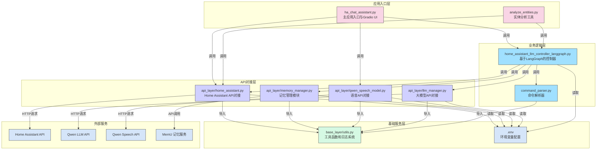
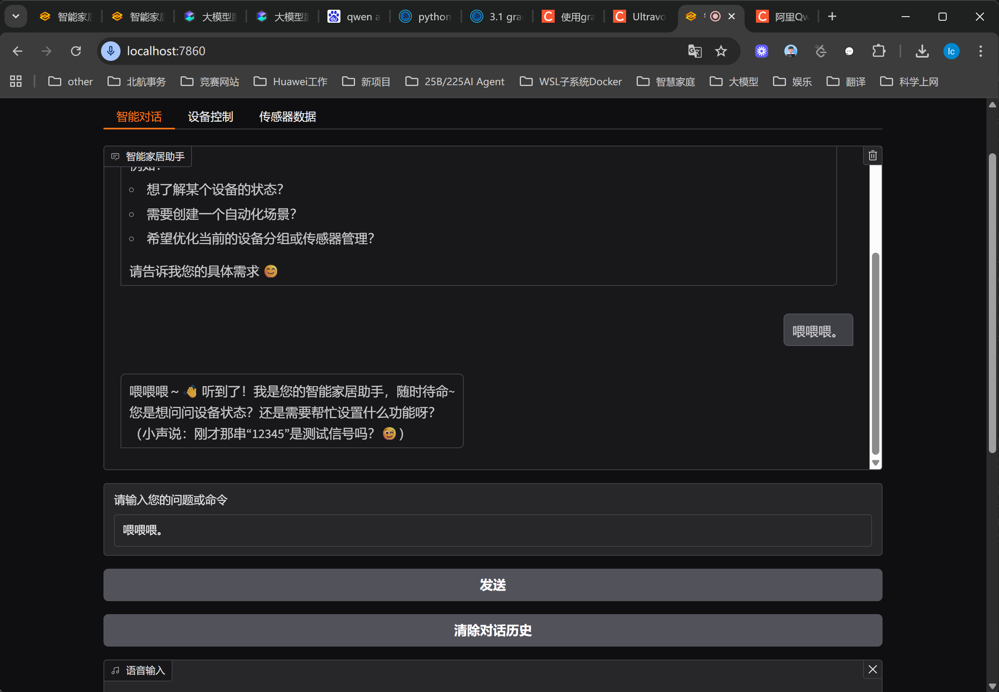
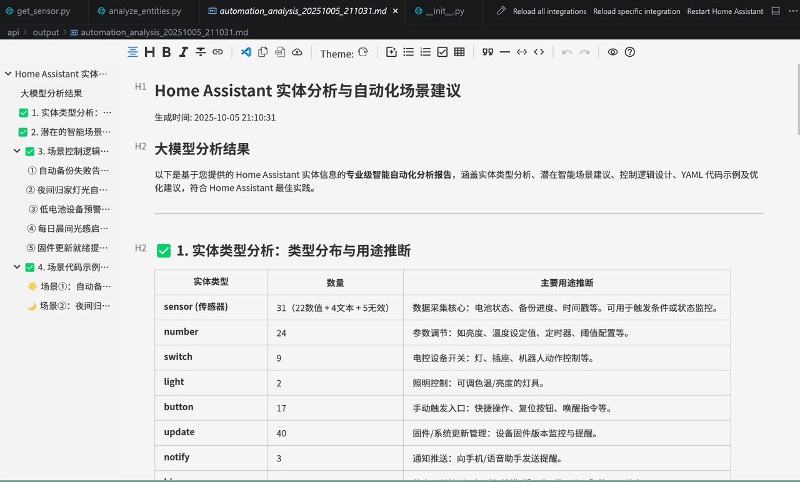
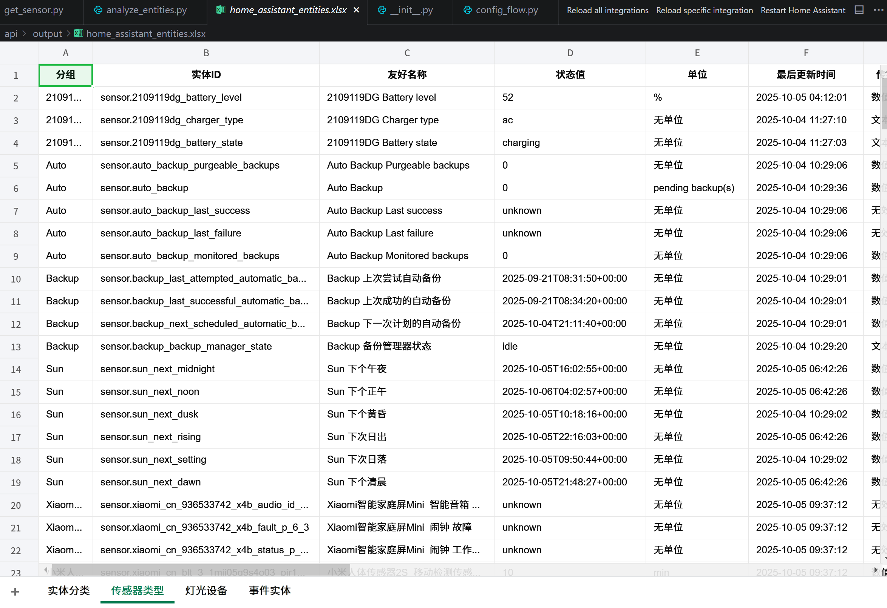
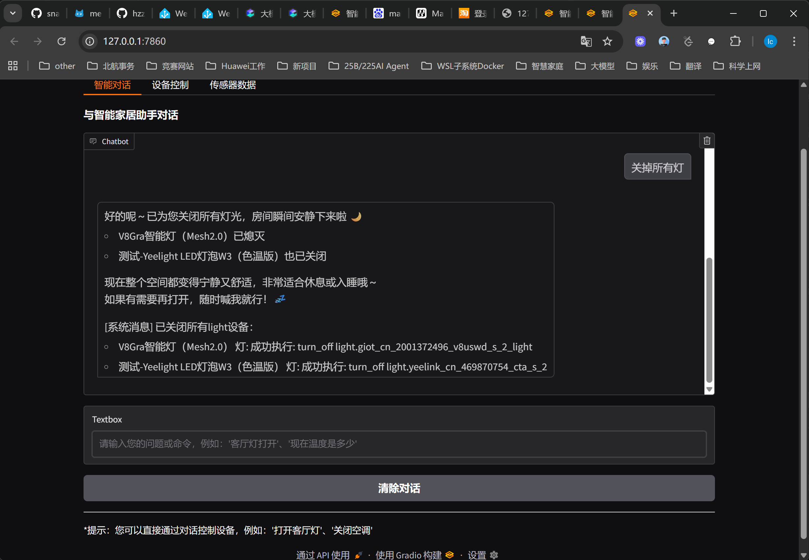

## Home Assistant 智能助手系统

### 项目介绍

这是一个基于Home Assistant的智能助手系统，集成了语音交互、自然语言处理和设备控制功能，通过友好的UI界面和语音接口为用户提供智能家居控制体验。系统利用大模型能力实现了智能对话和场景推荐，并支持实体数据分析和导出功能。最新版本已采用LangGraph重构核心控制器，提供更强大的对话流控制和状态管理能力，并实现了记忆管理模块，支持对话历史记忆存储与检索。

### 项目架构图



### 主要模块说明

1. **应用入口层**

   - `ha_chat_assistant.py`: 主应用入口，提供Gradio UI界面，包含设备控制、传感器数据查看和聊天对话等多个功能选项卡
   - `analyze_entities.py`: 实体分析工具，用于批量分析Home Assistant实体并生成详细报告
2. **业务逻辑层**

   - `home_assistant_llm_controller_langgraph.py`: 基于LangGraph的核心控制器，采用状态机模式管理对话流程，协调各API接口间的调用，处理实体分析、用户消息处理逻辑，负责命令解析与执行，并集成记忆功能
   - `command_parser.py`: 命令解析器，负责解析和执行控制指令，实现基于正则表达式的指令匹配和设备控制，由控制器调用
3. **API对接层**

   - `home_assistant.py`: Home Assistant API对接接口，负责与Home Assistant系统交互，获取实体数据和设备信息，新增MCP客户端管理功能
   - `memory_manager.py`: 记忆管理模块，封装与MemU API的交互，实现对话消息的存储（memorize_messages）和检索（retrieve_memory_info）功能
   - `qwen_speech_model.py`: 语音服务API对接接口，负责语音识别(ASR)和语音合成(TTS)功能，支持多种音频播放方式，包含音频状态跟踪和错误处理
   - `llm_manager.py`: 大模型服务API对接接口，封装了与Qwen大模型API的交互，支持OpenAI兼容格式，提供统一的模型调用接口
4. **基础服务层**

   - `utils.py`: 工具函数模块，提供日志系统配置和通用工具函数，支持UTF-8编码的多处理器日志记录
5. **外部服务**

   - Home Assistant API: 提供实体数据获取和设备控制功能
   - Qwen LLM API: 提供大模型对话和分析能力
   - Qwen Speech API: 提供语音识别和合成能力
   - MemU API: 提供对话记忆存储和检索服务

### 核心功能

1. **实体管理**

   - 自动获取和分类Home Assistant实体
   - 支持按名称和位置分组显示实体
   - 提供实体数据导出为Excel功能
2. **设备控制**

   - 可视化设备状态查看和控制
   - 支持通过文本指令控制设备
   - 支持批量控制同类型设备
3. **语音交互**

   - 语音识别输入
   - 语音合成输出
   - 自动播放回复语音
4. **智能对话**

   - 基于大模型的自然语言对话
   - 智能解析控制指令
   - 提供设备信息查询和状态汇报
5. **对话记忆**

   - 支持对话历史记忆存储
   - 实现基于分类的记忆检索
   - 个性化对话上下文理解
6. **实体分析**

   - 生成实体统计摘要
   - 大模型驱动的场景建议
   - 自动化配置示例生成

### 系统特性

1. **模块化设计**：清晰的分层架构，各模块职责明确，易于维护和扩展
2. **基于LangGraph的状态管理**：采用图结构和状态机模式，提供更灵活和强大的对话流控制
3. **多模态交互**：支持文本和语音两种交互方式
4. **智能识别**：基于正则表达式和大模型的双重识别机制
5. **完整日志**：支持控制台、主日志和历史日志三级日志系统，包含详细上下文信息
6. **自动更新**：定期更新实体数据，确保信息准确性
7. **对话记忆**：支持对话历史记忆存储和检索，提供个性化交互体验
8. **MCP集成**：集成MultiServerMCPClient，支持多种工具调用和扩展功能

### 依赖安装

文本依赖：

```shell
pip install requests openpyxl pandas gradio pydantic langgraph python-dotenv langchain-mcp-adapters langchain-openai
```

语音与记忆依赖：

```shell
pip install pyaudio pygame playsound pydub memu-py
```

### 使用方法

1. 配置设置

```shell
cp .env.example .env
```

2. 编辑 `.env` 文件，填入API密钥和配置参数

   - `HA_URL`: Home Assistant 访问地址
   - `HA_TOKEN`: Home Assistant 访问令牌
   - `QWEN_API_KEY`: Qwen API密钥
   - `QWEN_API_BASE`: Qwen API地址
   - `QWEN_MODEL`: Qwen模型名称
   - `QWEN_ASR_MODEL`: 语音识别模型
   - `QWEN_TTS_MODEL`: 语音合成模型
   - `OUTPUT_DIR`: 输出目录
   - `HA_MCP_ENDPOINT`: MCP服务端点
   - `USE_MEMORY_MESSAGES`: 是否启用记忆功能 (true/false)
   - `MEMU_API_KEY`: MemU API密钥
   - `MEMU_USER_ID`: MemU用户ID
   - `MEMU_AGENT_ID`: MemU助手ID
3. 运行应用

```shell
# 运行实体分析工具
python analyze_entities.py

# 运行主应用（带UI界面）
python ha_chat_assistant.py
```

### 项目结构

```
api/
├── ha_chat_assistant.py     # 主应用入口
├── analyze_entities.py      # 实体分析工具
├── source/                  # 源代码目录
│   ├── __init__.py
│   ├── api_layer/           # API对接层
│   │   ├── __init__.py
│   │   ├── home_assistant.py    # Home Assistant API对接
│   │   ├── llm_manager.py       # 大模型API对接
│   │   ├── memory_manager.py    # 记忆管理模块
│   │   └── qwen_speech_model.py # 语音API对接
│   ├── base_layer/          # 基础服务层
│   │   ├── __init__.py
│   │   └── utils.py         # 工具函数和日志系统
│   ├── home_assistant_llm_controller_langgraph.py  # 基于LangGraph的业务逻辑控制器
│   └── command_parser.py    # 命令解析器
├── logs/                    # 日志文件目录
├── output/                  # 输出文件目录
├── images/                  # 图片资源目录
├── .env.example             # 环境变量配置示例
└── .env                     # 环境变量配置(需自行创建)
```

### 最佳实践

1. 使用前确保Home Assistant服务正常运行，且API访问令牌有效
2. 定期更新实体数据以获取最新设备状态
3. 对于复杂的控制需求，优先使用自然语言对话方式
4. 查看logs目录下的日志文件了解系统运行状态
5. 通过output目录查看实体分析结果和导出文件

### 示例场景

1. **设备控制**：通过"打开客厅灯"、"关闭卧室空调"等简单指令控制设备
2. **状态查询**：询问"客厅温度多少"、"哪些灯是开着的"
3. **场景建议**：请求"为我推荐一些智能场景"获取大模型生成的场景建议
4. **数据分析**：运行分析工具获取实体统计和自动化建议
5. **记忆对话**：系统能够记住用户的偏好和之前的对话内容，如"我之前说过我喜欢晚上8点关闭所有灯"

### 效果展示

#### 主界面展示



#### 实体分析报告



#### 实体数据导出(Excel格式)



#### 灯光控制示例


