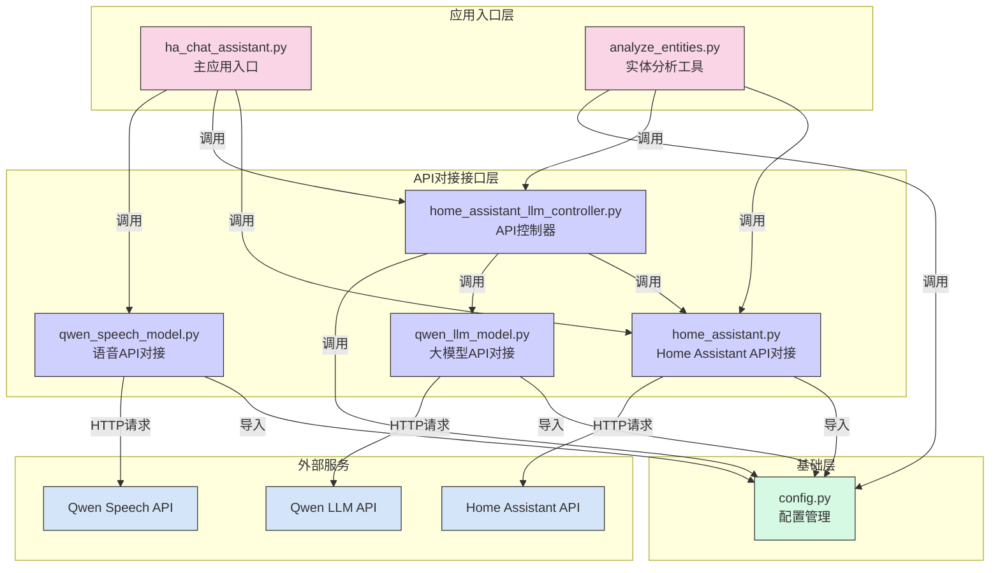

## 针对HomeAssistant的对外开放API对接UI Demo

### 项目架构图



### 主要模块说明

1. **应用入口层**

   - `ha_chat_assistant.py`: 主应用入口，提供Gradio UI界面，整合所有功能模块
   - `analyze_entities.py`: 实体分析工具，用于批量分析Home Assistant实体
2. **API对接接口层**

   - `home_assistant.py`: Home Assistant API对接接口，负责与Home Assistant系统交互
   - `qwen_speech_model.py`: 语音服务API对接接口，负责与语音识别和合成服务交互
   - `qwen_llm_model.py`: 大模型服务API对接接口，负责与Qwen大模型服务交互
   - `home_assistant_llm_controller.py`: 控制器，协调API接口间的调用
3. **基础层**

   - `config.py`: 配置文件，存储所有API密钥和配置参数
4. **外部服务**

   - Home Assistant API: 提供实体数据和控制功能
   - Qwen LLM API: 提供大模型能力
   - Qwen Speech API: 提供语音识别和合成能力

### 使用方法

文本依赖：requests，openpyxl，pandas，gradio

语音依赖：pyaudio

使用前需要在config中修改qwen和home assistant的key

```
cp source/config.py.sample source/config.py
```

然后就可以直接运行命令啦

```shell
python analyze_entities.py
python ha_chat_assistant.py
```

### 效果

#### 主界面展示


#### 实体分析报告(LaTeX格式)


#### 实体数据导出(Excel格式)


#### 灯光控制示例

