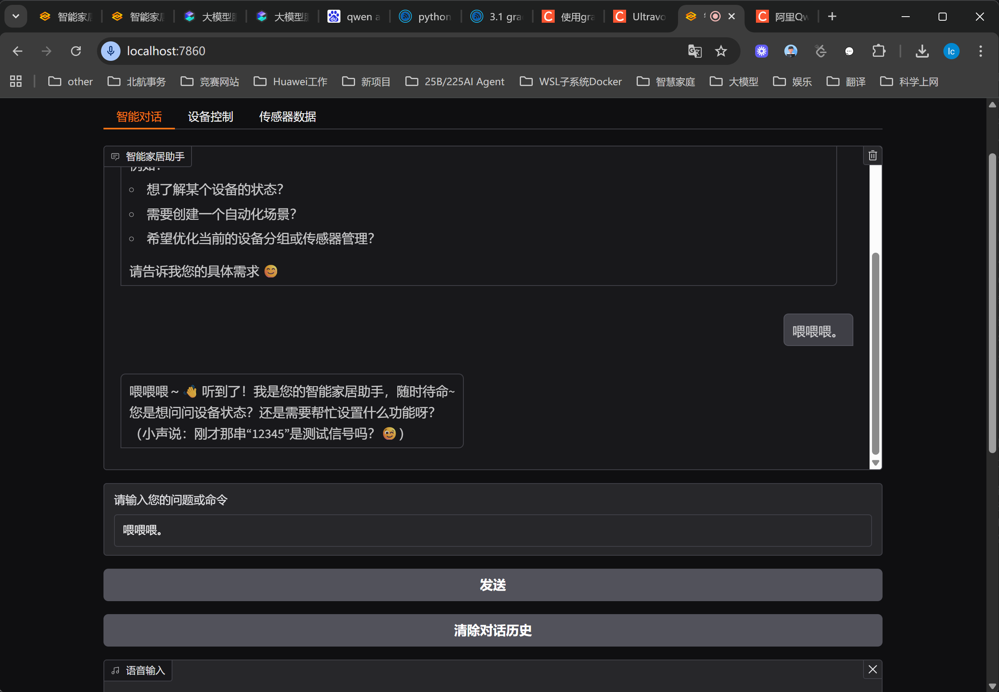
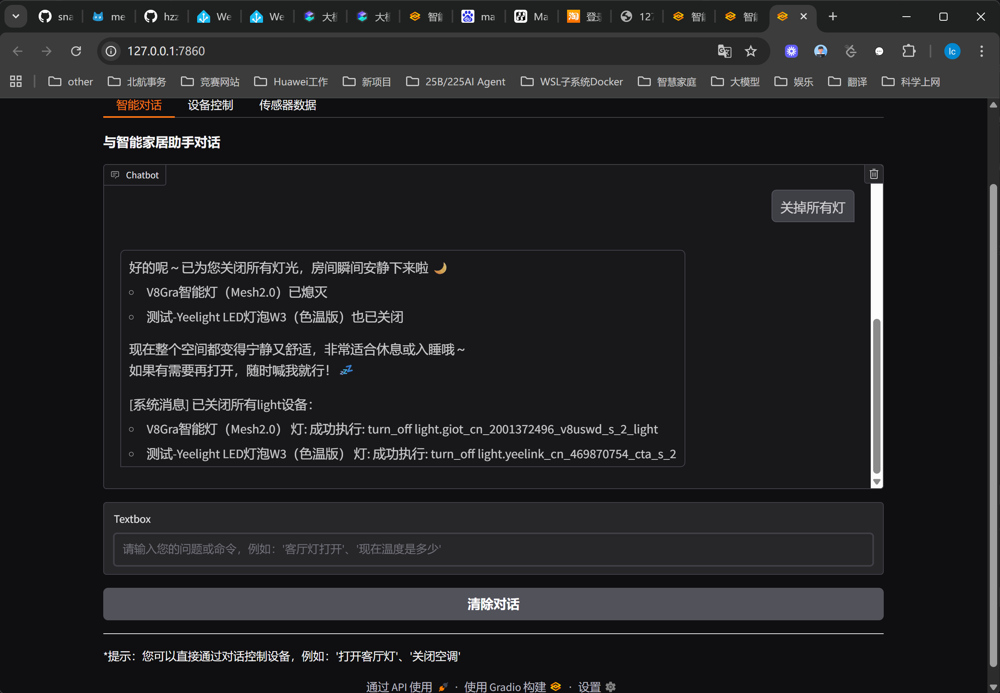
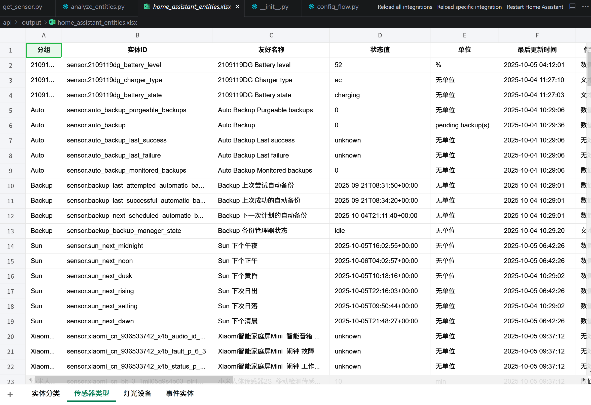
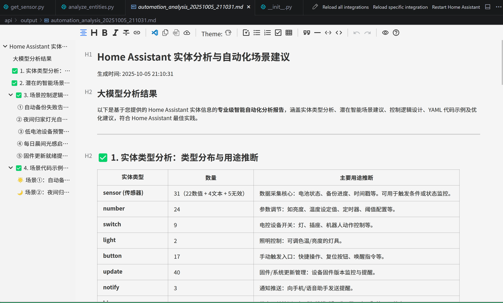

# HomeAssistant LLM 分析工具

基于 LangGraph 和大语言模型的 Home Assistant 智能家居助手，支持语音交互和对话记忆功能。

## 功能特性

- 🏠 **智能家居控制**: 通过自然语言控制 Home Assistant 设备
- 🤖 **LLM 集成**: 支持通义千问（Qwen）等多种大模型
- 🎤 **语音交互**: 支持 ASR（语音转文字）和 TTS（文字转语音）
- 🧠 **对话记忆**: 使用 MemU 记忆用户的偏好和历史对话
- 🎨 **Gradio 界面**: 友好的 Web 交互界面
- 🧪 **完整测试**: 159 个测试用例，61% 代码覆盖率

## 界面预览

### 对话功能


### 设备控制


### 数据分析
 | 
---|---

## 快速开始

### 环境要求

- Python >= 3.13
- Home Assistant 实例
- 通义千问 API Key（或其他 LLM API Key）

### 安装

```bash
# 克隆项目
git clone https://github.com/zlccccc/HomeAssistant-LLM-Analysis.git
cd HomeAssistant-LLM-Analysis

# 安装依赖
uv sync --extra dev

# 配置环境变量
cp .env.example .env
# 编辑 .env 文件，填入你的配置
```

### 配置说明

在 `.env` 文件中配置以下变量：

```ini
# Home Assistant 配置
HA_URL=http://localhost:8123
HA_TOKEN=你的长生命周期访问令牌

# LLM 配置
QWEN_API_KEY=你的通义千问API密钥
QWEN_API_BASE=https://dashscope.aliyuncs.com/compatible-mode/v1
QWEN_MODEL=qwen-flash

# 记忆功能（可选）
USE_MEMORY_MESSAGES=true
MEMU_USER_ID=user001

# 输出目录
OUTPUT_DIR=output
```

### 运行应用

```bash
# 启动应用
uv run python frontend/ha_chat_assistant.py

# 或使用开发脚本
./scripts/dev.sh run
```

访问 `http://localhost:7860` 使用 Gradio 界面。

## 开发

### 运行测试

```bash
# 运行所有测试
./scripts/dev.sh test

# 运行快速测试（跳过慢测试）
./scripts/dev.sh test-fast

# 生成覆盖率报告（HTML）
./scripts/dev.sh test-html
```

### 代码质量

```bash
# 格式化代码
./scripts/dev.sh format

# 运行 linter
./scripts/dev.sh lint

# 类型检查
./scripts/dev.sh type-check
```

## 项目结构

```
HomeAssistant-LLM-Analysis/
├── frontend/                    # 前端层
│   ├── ha_chat_assistant.py    # Gradio UI 入口
│   └── api_layer/
│       └── qwen_speech_model.py # 语音模型
│
├── backend/                    # 后端层
│   └── source/
│       ├── home_assistant_llm_controller_langgraph.py  # LangGraph 控制器
│       ├── command_parser.py    # 命令解析器
│       └── api_layer/
│           ├── home_assistant.py    # Home Assistant API
│           ├── llm_manager.py       # LLM 管理器
│           └── memory_manager.py    # 记忆管理
│
├── test/                       # 测试套件
│   ├── conftest.py             # 测试配置
│   ├── test_home_assistant.py
│   ├── test_llm_manager.py
│   ├── test_command_parser.py
│   └── ...
│
├── scripts/                    # 开发脚本
│   ├── dev.sh                  # 开发助手
│   ├── test.sh                 # 测试运行器
│   └── format.sh               # 代码格式化
│
├── docs/                       # 文档
│   ├── README.md               # 项目概览
│   ├── SETUP.md                # 安装指南
│   └── README_MEMU.md          # MemU 记忆系统
│
├── pyproject.toml              # 项目配置
├── .pre-commit-config.yaml     # Pre-commit 钩子
└── CLAUDE.md                   # AI 编码助手指南
```

## 工作原理

1. **用户输入** → Gradio 界面接收用户消息
2. **消息分析** → LangGraph 控制器分析消息并检查是否有可执行命令
3. **命令执行** → CommandParser 解析并执行设备控制命令
4. **响应生成** → 结合设备状态、对话记忆和 LLM 生成响应
5. **语音输出** → 可选的 TTS 语音播报

## 测试标记

- `unit`: 单元测试（无外部依赖）
- `integration`: 集成测试（可能需要外部服务）
- `slow`: 慢速测试（可用 `-m "not slow"` 跳过）
- `requires_ha`: 需要 Home Assistant 连接
- `requires_llm`: 需要 LLM API 连接

## 文档

- [CLAUDE.md](CLAUDE.md) - AI 编码助手指南
- [docs/SETUP.md](docs/SETUP.md) - 详细安装指南
- [docs/README_MEMU.md](docs/README_MEMU.md) - MemU 记忆系统说明

## License

MIT
